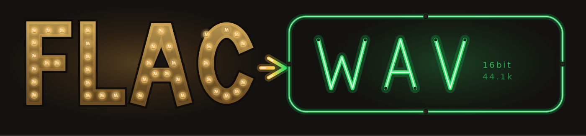

<div align="center">



<br><br>


**Convert lossless FLAC into car-stereo-ready WAV — as a web app or a shell one-liner.**
Built for the **Pioneer DEH-80PRS**; works for any head unit limited to LPCM 16-bit WAV.

</div>

---

## 🎛️ Why

The DEH-80PRS plays WAV from USB/SD **only as LPCM 8/16-bit, 16–48 kHz** — no FLAC,
no 24-bit, nothing above 48 kHz (per the official operation manual). Both tools here
convert to the best format the deck accepts: **16-bit / 44.1 kHz PCM**, with metadata
kept, cover art stripped safely, and triangular-HP dither on 24-bit downconversions.

## 🖥️ The app

```bash
cd app
python3 app.py          # opens http://127.0.0.1:8574 in your browser
```

No pip packages needed — Python 3.8+ standard library only. `ffmpeg`/`ffprobe`
must be installed (`sudo apt install ffmpeg`).

- Queue FLACs from **any number of folders** (files or whole folders)
- Every file is validated by magic bytes + ffprobe — a renamed `.txt` can't crash a run
- One output destination — point it straight at your USB stick
- Live per-file and overall progress, cancel anytime, name collisions get `(2)` suffixes
- Skips existing WAVs unless you tick *overwrite*
- Marquee-bulb FLAC / neon WAV theme with the rotating defective-bulb animation

## ⌨️ The CLI

```bash
./flac2wav.sh                  # interactive picker in current folder
./flac2wav.sh --all            # convert every .flac here
./flac2wav.sh song.flac        # convert specific file(s)
./flac2wav.sh -y --all         # overwrite existing .wav files
./flac2wav.sh -d ~/Music --all # work in another folder
```

Output lands in `wav16/` next to your FLACs. Same validation and ffmpeg
settings as the app.

## 📻 DEH-80PRS notes

| Format | USB/SD support |
|---|---|
| WAV LPCM 16-bit / 44.1 kHz | ✅ **what these tools produce** |
| WAV LPCM 8/16-bit, 16–48 kHz | ✅ |
| WAV 24-bit or > 48 kHz | ❌ |
| FLAC | ❌ (never added in firmware) |

> 💡 The deck displays only the **first 32 characters** of a filename — keep names short.

## 📁 Layout

```
flac2wav/
├── flac2wav.sh          # CLI converter
├── app/
│   ├── app.py           # local web server (stdlib only)
│   └── static/          # UI + SVG art (banner, graffiti wall, icon)
└── docs/banner.png      # README hero
```

## 📄 License

MIT — do whatever you want, no warranty.
