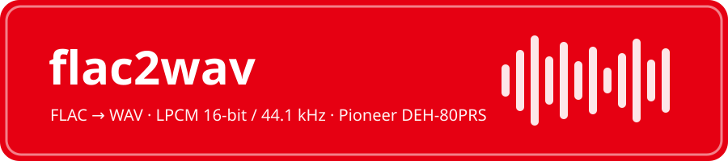
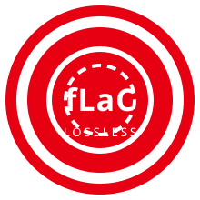
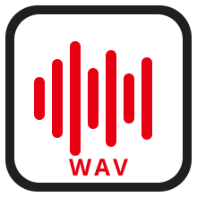

<div align="center">



<br><br>


**A safe, interactive Bash converter that turns lossless FLAC into car-stereo-ready WAV.**
Built for the **Pioneer DEH-80PRS**, works for any head unit limited to LPCM 16-bit WAV.

</div>

---

<table align="center">
<tr>
<td align="center" width="280">
  <br><br>
  <b>FLAC</b> · Free Lossless Audio Codec<br>
  <sub>any bit depth · any sample rate · cover art OK</sub>
</td>
<td align="center" width="80"><h1>→</h1></td>
<td align="center" width="280">
  <br><br>
  <b>WAV</b> · LPCM <code>pcm_s16le</code><br>
  <sub>16-bit · 44.1 kHz · triangular dither · tags kept</sub>
</td>
</tr>
</table>

---

## 🎮 Why

The DEH-80PRS plays WAV from USB/SD **only as LPCM 8/16-bit, 16–48 kHz**. No FLAC, no 24-bit, nothing above 48 kHz (per the official operation manual). This script converts your FLAC library to the highest format the deck accepts: **16-bit / 44.1 kHz PCM**.

## ⭐ Features

| | |
|---|---|
| 🕹️ **Interactive picker** | Numbered menu — pick `1 3 5-8`, `a` for all, `q` to quit |
| 🛡️ **Real file-type check** | Magic bytes + ffprobe; a renamed `.txt` can't crash the run |
| 🎨 **Cover-art safe** | Embedded artwork is stripped (`-vn`) instead of breaking the WAV muxer |
| 🎚️ **Proper downconversion** | Forced `pcm_s16le` with triangular-HP dither for 24-bit sources |
| 🏷️ **Metadata preserved** | Title/artist tags carried into the WAV |
| ♻️ **No accidental overwrites** | Existing files skipped unless you pass `-y` |
| 📊 **Run summary** | `done / skipped / failed` counts, meaningful exit codes |

## 🔧 Requirements

`bash` ≥ 4.0 and `ffmpeg` (includes `ffprobe`):

```bash
sudo apt install ffmpeg        # Debian/Ubuntu
sudo dnf install ffmpeg        # Fedora
brew install ffmpeg            # macOS
```

## 🚀 Usage

```bash
chmod +x flac2wav.sh

./flac2wav.sh                  # interactive picker in current folder
./flac2wav.sh --all            # convert every .flac in the folder
./flac2wav.sh song.flac        # convert specific file(s)
./flac2wav.sh -y --all         # overwrite existing .wav files
./flac2wav.sh -d ~/Music --all # work in another folder
./flac2wav.sh -h               # help
```

Output lands in `wav16/` next to your FLACs.

```
Found 4 FLAC file(s) in /home/you/Music:

    1) art track.flac
    2) hi_res.flac
    3) live set.flac
    4) normal.flac

Select: numbers and ranges (e.g. 1 3 5-8), a = all, q = quit
choice> 1-2 4

3 file(s) queued -> wav16/
Continue? [y/N]: y
```

## 📻 DEH-80PRS compatibility notes

| Format | USB/SD support |
|---|---|
| WAV LPCM 16-bit / 44.1 kHz | ✅ **this script's output** |
| WAV LPCM 8/16-bit, 16–48 kHz | ✅ |
| WAV 24-bit or > 48 kHz | ❌ |
| FLAC | ❌ (never added in firmware) |

> 💡 The deck displays only the **first 32 characters** of a filename — keep names short on the USB stick.

## 📄 License

MIT — do whatever you want, no warranty.

<div align="center">
<br>
<sub>Not affiliated with Nintendo, Pioneer, or Xiph.Org — color palette and codec marks are fan-made representations.</sub>
</div>
